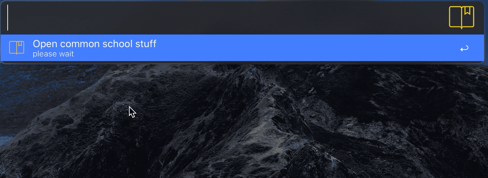
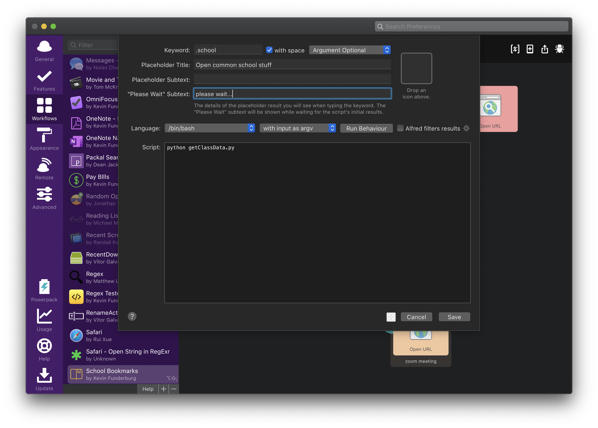
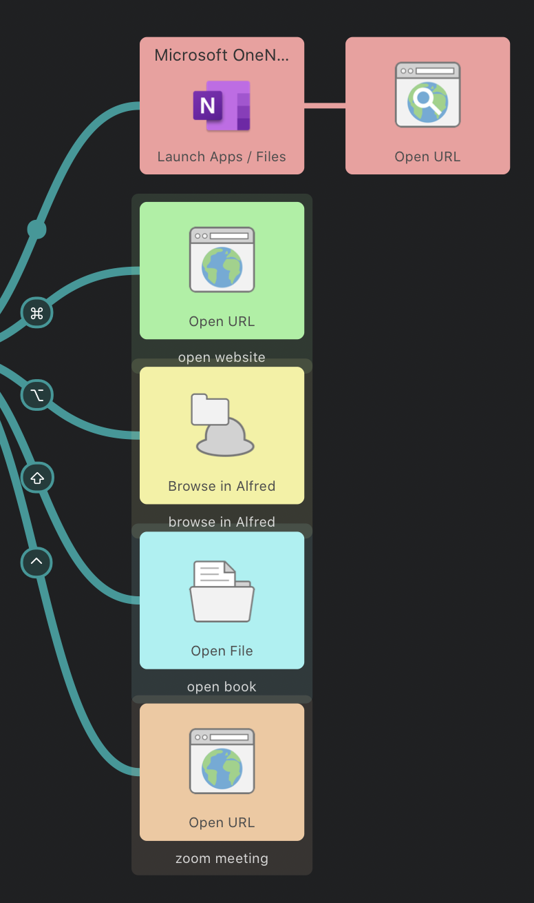

# Alfred School Bookmarks

This little workflow was made to quickly and easily get to all the websites, folders, ebooks, zoom meetings  etc. that I need frequent access to for school. Although a simple concept, this is probably the most used and appreciated out of all my workflows in that it makes me much more organized. Sharing this workflow, however, is tricky because what I may want access to is not the same as what others would, so I decided (for now) I would post the code and show how easily you could adjust it for yourself.

> Because of this, this repo is more of a demonstration on building a useful Alfred workflow rather than sharing an executable workflow to be installed (although I may make a shareable version later).

_Here's a screenshot of the workflow itself:_


## Configuration
In this workflow, I wanted to have quick access to the following for every class:
1. The folder on my disk
2. The ebook
3. My Microsoft OneNote section
4. The class website
5. The zoom meeting (for COVID-19)

I did this by assigning the values for each one to a modifier key as in the following table.

modifer  |  opens
--|--
 <kbd>⌘</kbd> |  class website
 <kbd>⌥</kbd> |  class folder
 <kbd>⇧</kbd> |  ebook
 <kbd>⌃</kbd> |  zoom meeting
 no modifer |  OneNote section

- Since I have 3 classes, I have access to all 15 locations in an instant by using the shortcut key <kbd>⌥</kbd><kbd>⇧</kbd><kbd>;</kbd>
- I added links to my personal and university github profiles for more convenience



### Storing the Data
So to store the data for each of these paths, I created a small SQlite database called `classdata.db` and used the following command (with some stuff changed for privacy) to create a `fall2020` table to store the data for each class.

> this is the contents of the file `create semester table.sql`

```SQL
-- you can change these columns to whatever
-- information you would like

CREATE TABLE "fall2020" (
	"name"			TEXT NOT NULL,
	"folderPath"	TEXT NOT NULL,
	"bookPath"		TEXT,
	"oneNote"		TEXT,
	"website"		TEXT
    "zoom"          TEXT
);

INSERT INTO fall2020 VALUES (
	'Algorithm Design',
	'~/Dropbox/School/algorithm design',
	'~/Dropbox/School/algorithm design/Thomas H. Cormen, Charles E. Leiserson, Ronald L. Rivest, Clifford Stein - Introduction to Algorithms 3rd Edition (2009).pdf',
	'onenote:https://d.docs.live.net/9478a1a4ec3795b7/somethingsomething',
	'https://myclasswebsite1',
	'https://zoomurl'
	);
INSERT INTO fall2020 VALUES (
	'Compilier Construction',
	'~/Dropbox/School/compiler construction',
	'~/Dropbox/School/compiler construction/Keith Cooper, Linda Torczon - Engineering a Compiler-Elsevier Science & Technology (2011).epub',
	'onenote:https://d.docs.live.net/9478a1a4ec3795b7/somethingsomething',
	'https://myclasswebsite2',
	'https://zoomurl'
	);
INSERT INTO fall2020 VALUES (
	'Computer Networks',
	'~/Dropbox/School/computer networks',
	'~/Dropbox/School/algorithm design/Thomas H. Cormen, Charles E. Leiserson, Ronald L. Rivest, Clifford Stein - Introduction to Algorithms 3rd Edition (2009).pdf',
	'onenote:https://d.docs.live.net/9478a1a4ec3795b7/somethingsomething',
	'https://myclasswebsite2',
	'https://zoomurl'
	);

```

> Here's the result below (using DB Browser for SQLite)


### Update The Code
Once the data is stored, you just need to make sure the `def execute_sql`function in the `getClassData.py` file fits your information. Below points out where to make the change.

```python
def execute_sql(conn, sql):
    log.info("query: " + sql)
    cur = conn.cursor()
    cur.execute(sql)
    rows = cur.fetchall()
    for row in rows:
        name = row[0]			#
        folderPath = row[1]		#
        bookPath = row[2]		# adjust these variables for your information
        oneNote = row[3]		#
        website = row[4]		#
        zoom = row[5]			#
        it = wf.add_item(uid=name,
                         title=name,
                         subtitle="open OneNote section",
                         arg=oneNote,
                         autocomplete=name,
                         valid=True,
                         icon="icon.png",
                         icontype="file")
        it.add_modifier('cmd',
                        subtitle="go to class website: " + website,
                        arg=website,
                        valid=True)
        it.add_modifier('alt',
                        subtitle="browse in Alfred",
                        arg=folderPath,
                        valid=True)
        it.add_modifier('shift',
                        subtitle=bookPath,
                        arg=bookPath,
                        valid=True)
        it.add_modifier('ctrl',
                        subtitle="go to zoom meeting",
                        arg=zoom,
                        valid=True)
```

- Once that's squared away, just make sure the `Script Filter` action looks like this:


- Then just make the rest of the actions look something like this:

    <p align="center">
    <p>
    </p>

And that's it! I really recommend this one, super quick and useful, but also makes me feel much more organized.
