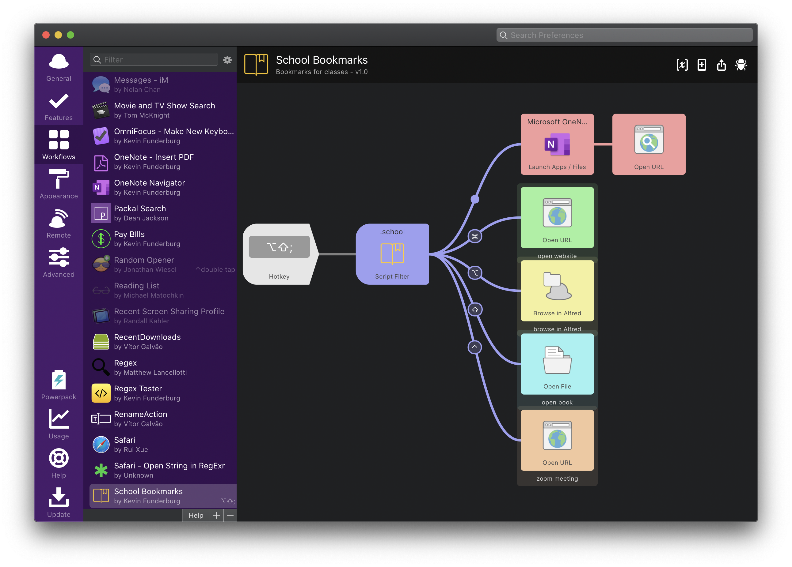

# Alfred School Bookmarks

This is a little workflow I made to try and help navigate to all the websites, folders, books etc. that I use constantly throughout a semester. I am posting this as more of a demonstration seeing as what people want as a shortcut will vary for person to person, but if you want to use this is a very easy workflow to adapt.

Here's what the workflow looks like itself:


## Configuration
In this workflow, here's what I wanted to get to quickly for each class:
1. Its folder
2. Its ebook
3. Its OneNote Page
4. The class website
5. the zoom meeting

So I created a small SQlite database called `classdata.db` to store the data for each class using the following SQL command (with some privacy stuff changed):

```SQL

CREATE TABLE "fall2020" (
	"name"			TEXT NOT NULL,
	"folderPath"	TEXT NOT NULL,
	"bookPath"		TEXT,
	"oneNote"		TEXT,
	"website"		TEXT
    "zoom"          TEXT
);

INSERT INTO fall2020 VALUES (
	'Algorithm Design',
	'~/Dropbox/School/algorithm design',
	'~/Dropbox/School/algorithm design/Thomas H. Cormen, Charles E. Leiserson, Ronald L. Rivest, Clifford Stein - Introduction to Algorithms 3rd Edition (2009).pdf',
	'onenote:https://d.docs.live.net/9478a1a4ec3795b7/somethingsomething',
	'https://myclasswebsite1',
	'https://zoomurl'
	);
INSERT INTO fall2020 VALUES (
	'Compilier Construction',
	'~/Dropbox/School/compiler construction',
	'~/Dropbox/School/compiler construction/Keith Cooper, Linda Torczon - Engineering a Compiler-Elsevier Science & Technology (2011).epub',
	'onenote:https://d.docs.live.net/9478a1a4ec3795b7/somethingsomething',
	'https://myclasswebsite2',
	'https://zoomurl'
	);
INSERT INTO fall2020 VALUES (
	'Computer Networks',
	'~/Dropbox/School/computer networks',
	'~/Dropbox/School/algorithm design/Thomas H. Cormen, Charles E. Leiserson, Ronald L. Rivest, Clifford Stein - Introduction to Algorithms 3rd Edition (2009).pdf',
	'onenote:https://d.docs.live.net/9478a1a4ec3795b7/somethingsomething',
	'https://myclasswebsite2',
	'https://zoomurl'
	);

```

> Here's the result below (using DB Browser for SQLite)


After that, it's basic python code, all I did was assign each one of the things I cared about to a modifier key:
- <kbd>⌘</kbd> = class website
- <kbd>⌥</kbd> = browse class folder
- <kbd>⇧</kbd> = open ebook
- <kbd>⌃</kbd> = zoom meeting
- no modifer = open OneNote section


So if you want to adapt this for yourself, adjust the `def execute_sql`function in the `getClassData.py` file for your information. Below points out where to make the change.

```python
def execute_sql(conn, sql):
    log.info("query: " + sql)
    cur = conn.cursor()
    cur.execute(sql)
    rows = cur.fetchall()
    for row in rows:
        name = row[0]			#
        folderPath = row[1]		#
        bookPath = row[2]		# adjust these variables for your information
        oneNote = row[3]		#
        website = row[4]		#
        zoom = row[5]			#
        it = wf.add_item(uid=name,
                         title=name,
                         subtitle="open OneNote section",
                         arg=oneNote,
                         autocomplete=name,
                         valid=True,
                         icon="icon.png",
                         icontype="file")
        it.add_modifier('cmd',
                        subtitle="go to class website: " + website,
                        arg=website,
                        valid=True)
        it.add_modifier('alt',
                        subtitle="browse in Alfred",
                        arg=folderPath,
                        valid=True)
        it.add_modifier('shift',
                        subtitle=bookPath,
                        arg=bookPath,
                        valid=True)
        it.add_modifier('ctrl',
                        subtitle="go to zoom meeting",
                        arg=zoom,
                        valid=True)
```
